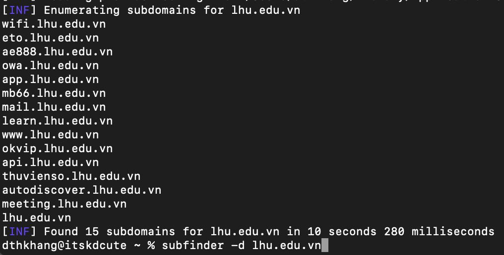
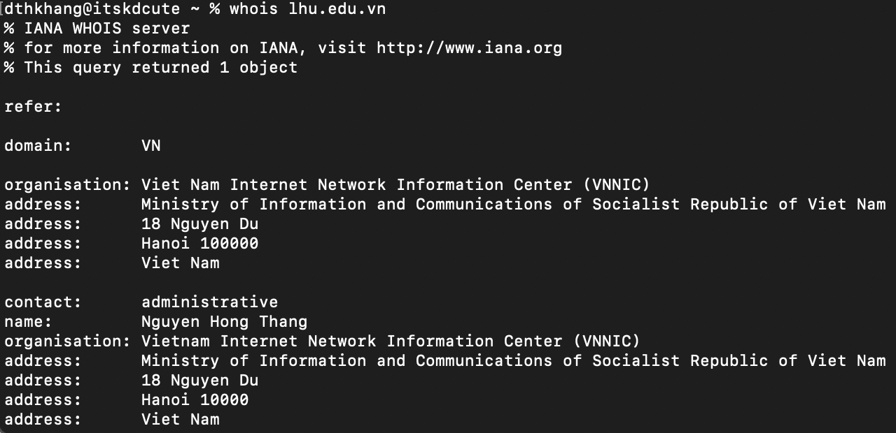

# Tìm hiểu Information Gathering
> TÊN TÀI LIỆU: Information Gathering Document 
THỰC HIỆN: Dương Tôn Hoàng Khang  
CẬP NHẬT CUỐI CÙNG: 30/09/2024
>
# Mục lục:
### [1. Information Gathering là gì?](#phan-1)
### [2. Passtive Information Gathering](#phan-2)
 - [Search DNS, Whois Lookup](#dns)
 - [Google Hacking](#googlehacking)
### [3. Active Information Gathering?](#phan-3)
 - [Port Scanning](#nmap)
 - [Banner Grabbing](#banner)
### [4. Discovering Sensitive Files](#phan-4)

# Nội dung:

## 1. Information Gathering (Thu thập thông tin) là gì?
- Là bước đầu tiên trong quy trình Pentest, mục tiêu của bước này là thu thập thật nhiều thông tin của Target như Domains, Subdomains, Technology, Port service,... để phục vụ cho quá trình Pentest.
- Có 2 loại Information Gathering:

    - Passtive Information Gathering (Thu thập thụ động):
        - Thu thập thông tin mà không trực tiếp tương tác với hệ thống của Target, giúp tránh được việc bị phát hiện. Một số phương pháp phổ biến như: 
        
            - Search DNS: Sử dụng các tools (subfinder, whois lookup) để thu thập thông tin về tên miền, địa chỉ IP,...

            
            

            - Google Dorking (Google Hacking): Google Dorking sử dụng các "dork" (toán tử tìm kiếm đặc biệt) để thu hẹp kết quả, giúp tìm thông tin cụ thể về mục tiêu (Target), loại tệp, hoặc các trang web có cấu hình bảo mật kém.
              

            Một số "dork" phổ biến:  

            site: – Tìm kiếm trong một trang web cụ thể.  
            Ví dụ: site:example.com (tìm tất cả các trang thuộc miền example.com). 
            filetype: – Tìm kiếm các loại tệp cụ thể. 

            Ví dụ: filetype:pdf site:example.com (tìm các tệp PDF trên example.com). 
            intitle: – Tìm các trang có cụm từ trong tiêu đề trang. 

            Ví dụ: intitle:"index of" (tìm các trang có cụm từ "index of" trong tiêu đề, thường là các trang thư mục mở). 
            inurl: – Tìm các trang có cụm từ trong URL. 

            Ví dụ: inurl:admin (tìm các trang có từ "admin" trong URL, có thể dẫn tới trang quản trị).
            allintext: – Tìm các trang có chứa cụm từ trong nội dung.

            Ví dụ: allintext:password filetype:log (tìm các file log chứa từ "password").
            cache: – Tìm phiên bản được Google lưu trong bộ nhớ đệm của một trang web.

            Ví dụ: cache:example.com (hiển thị phiên bản Google cache của example.com).

    - Active Information Gathering (Thu thập chủ động)
        - Thu thập thông tin bằng cách tương tác trực tiếp với hệ thống của Target, ví dụ:

            - Port Scanning: sử dụng nmap để scan
            

            - Banner Grabbing: Thu thập thông tin từ các dịch vụ chạy trên hệ thống, chẳng hạn như phiên bản phần mềm, hệ điều hành, v.v.
            

## 4. Discovering Sensitive Files
Ta có thể sử dụng dirsearch để scan các Sensitive Files

